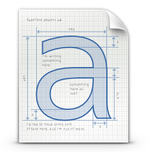
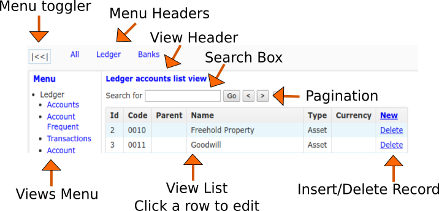
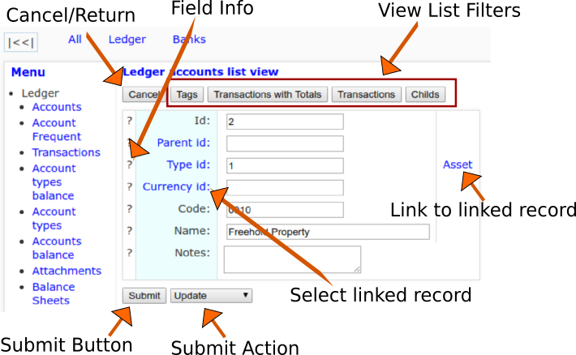

#About the presentation:

##A simple method/application to collect requirements, document and prototype applications.

* * *

##About me: [https://github.com/mingodad](https://github.com/mingodad)

####My name is Domingo I'm a Spanish/Brazilian that started working with electronics and moved slowly to software, I'm at it now around 20  years, mainly working with databases, network, servers, command line, desktop and web applications using custom and third party tools, compiled and scripting languages.

####I've been living and working in Brazil, Spain, UK and USA.

* * *

#Huston we have a problem !
#What's it ?

##Create, document and prototype applications at "user level" in near realtime (live).

* * *

#Desired requirements of the solution:

1. **Simple** (although simplicity is in the eye of the beholder).
2. **Fast** (be able to extend/refine in near realtime (live)).
3. End users must be able to **use/check** it as we develop in near realtime (live).
4. Self **documented** (requirements/prototype/documentation at the same time).
5. The **prototype** must be functional, self contained, distributable to be used as an important piece of a contract for the final product.
6. Be able to be used for **onboarding** newcomers (users, developers, ...).
7. Be **introspectable** (ability to query it's structure, components and relations).
8. Need to be **multi user** and work on the major platforms (WEB, DESKTOP, MOBILE, LINUX, OSX, WINDOWS, ANDROID, IOS).

* * *

#Now I'll present a candidate solution with the following tradeoffs:

1. **Minimal** auto generated funtional web app user interface.
2. Need of database and **SQL** knowledge (with sqlite limitations).
3. Need of **HTTP, HTML and JAVASCRIPT** knowledge.
4. Need experience **talking with people** with varing computer/IT knowledge/skills.
5. It only try to provide **basic and simple** sugar on top of the raw SQL for the developer.
6. It assumes operation on a **friendly environment**, it doesn't expect to be attacked by "black hats" but should be gently with "end users" mistakes.

* * *

#High level overview of the candidate solution, it has:

- A custom **data dictionary** that store the metadata, structure and connections between menus/tables/views/... and all are stored on single sqlite database.
- An **http server** were the application logic runs and send/receive data to the html/javascript frontend.
- A bare bones **html/javascript frontend** that render our minimal user interface and manage the frontend logic.
- All data is sent/received through **HTTP/API** calls (json, binary, form-data, form-url-encoded, ...).
- The data is rendered through **html tables** and edited using **html forms**.
- The lists can be **filtered** (show only data that match one or more field values).
- The forms are filled through "free form entries" or **fields selected from other view lists**.
- The main logic is **SQL** based (dml, tables, views, triggers, primary keys, foreign keys, constraints, ...).

####When creating "end user" prototypes most of the above are transparent/invisible except the SQL for the developer.

* * *

#Brief description of the "end user" user interface:

####The end user interface consist of a menu, data table lists, data table forms, edit links, table filters and limited custom html/javascript.

* * *
###Main Screen

* * *
###Edit Screen

* * *

#Brief description of the "developer ide" web gui:

